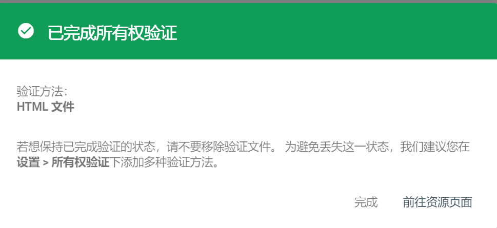

# 1. Step
网站在没有提交搜索引擎收录之前，直接搜索你网站的内容是搜不到的，因为搜索引擎不会去检索你的Github仓库。下面的解决方法
## 1.1 Check 是否被谷歌收录
打开谷歌搜索，在搜索框中输入

site:https://huweim.github.io/ 

如果提示说：找不到和您查询的“site:https://huweim.github.io/ ” 相符的内容或信息，说明未被收录。

如果搜索结果的第一条就是你的博客站点，说明已被收录，不用再继续看下面的内容了。

## 1.2 提交谷歌搜索

进入Google Web Master Search Console，登录之后提交你的博客网址

提交后需要通过 DNS 记录验证域名所有权，Github DNS 服务器配置教程：https://docs.github.com/cn/enterprise-server@3.2/admin/configuration/configuring-network-settings/configuring-dns-nameservers

:x: 1.2.1 ssh 链接到 GitHub Enterprise Server instance，不使用域名验证方法，使用上传 html 文件的方法

## 1.3 上传 html 文件

### 1.3.1 放在 content
将下载的 html 文件放置在 `content` 目录下，开启服务后，`http://localhost:1313/googlead4e3c06724927ae/` 能够索引到即可，然后 push to Github.  :x:
### 1.3.2 放在 theme/layouts
放在 content 目录下不行，检索不到后缀 .html，比如 `http://localhost:1313/googlead4e3c06724927ae.html/` 就索引不到了。折腾了半个小时，发现应该放在 `themes\jane\layouts` 目录下，因为发现 `http://localhost:1313/index.html` 才能够有效地索引，那么对于 `googlead4e3c06724927ae.html` 也是一样的道理。

不过仍然找不到，不是说复制到`themes\jane\layouts` 目录下就能索引到，比如我复制了一个 `404.html`，改名为 `40411.html`，是无法直接找到的。

### 1.3.3 static

知识：static这个文件夹有一个特性就是可以将里面的文件复制到public文件夹里面。我们可以将我们自定义的页面放到这个目录下，因为它不是hugo生成的，所以不会被覆盖。

首先在根目录下的 `static` 下创建一个目录，目录名是你的页面名（googlead4e3c06724927ae.html）。然后在这个目录下创建 `index.html`，把 `googlead4e3c06724927ae.html` 中的内容复制到 `index.html`，目的就达到了。这样，访问 `http://localhost:1313/googlead4e3c06724927ae.html/` 页面时加载的就是 `googlead4e3c06724927ae.html` 的内容。

2022-05-09 11:13:15，这一方法验证成功。

## 1.4 等待

提交博客之后，需要等待一段时间才能在Google上搜到，因为Google需要时间来处理我们的请求、抓取相应网页并将其编入索引。

# Reference

https://huiyu-li.github.io/2019/11/27/Tools/2019-11-27-%E8%AE%A9%E8%B0%B7%E6%AD%8C%E6%90%9C%E7%B4%A2%E5%88%B0%E8%87%AA%E5%B7%B1%E5%86%8DGitHub%E4%B8%8A%E7%9A%84%E5%8D%9A%E5%AE%A2/
