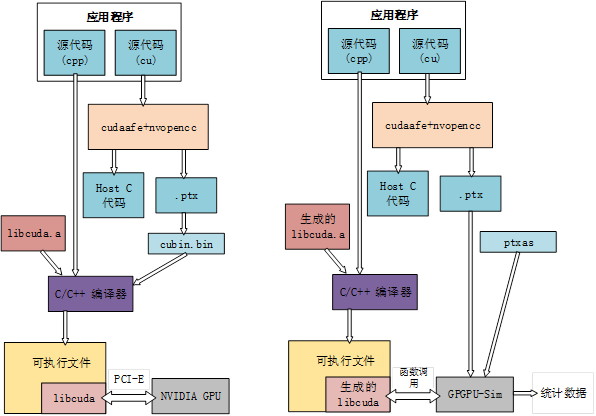

# 0. 前言

在 GPGPU-Sim 跑一些比较大的 benchmark, 或者想要同时跑很多组 benchmark 的时候，在自己的电脑上跑，或者在虚拟机上运行的话速度肯定达不到要求，会成为工作中瓶颈。因此了解一下如何在服务器上跑 simulation, 以及如何提高运行 benchmark 的速度。

# 1. GPGPU-Sim 运行机制

首先要理解 application 是如何运行在 real machine 以及 GPGPU-Sim 上的，他们的区别在哪里？这里以 CUDA 代码为例。

GPGPU-Sim_vs_Real_Machine

## 1.1 Real Machine

CUDA application 分为 host code and device code, 使用 nvcc 编译  .cu 代码时, 会将 host code 和 device code 分开。device code 被编译为 .ptx 文件，再通过 ptxas 编译为 cubin.bin 文件。host code, libcuda.a, cubin.bin 文件由 C/C++编译器编译了解生成可执行文件。

如何运行 CUDA application? 调用 libcuda 内的**接口**以在 GPU 上运行 device code.

## 1.2 GPGPU-Sim

编译 GPGPU-Sim 会生成自己的 libcuda.so 库文件，通过 `ldd Your_application` 可以看到 libcudart.so.4.2 链接到模拟器的这个库文件。该库文件实现了 CUDA Runtime 函数库内大部分函数的重定义。

如何运行 CUDA application? 通过 libcuda 调用 GPGPU-Sim 内的**模拟接口**，实现在 GPGPU-Sim 上运行 CUDA appliaction.

## 1.3 主要区别

# Reference

https://blog.csdn.net/litdaguang/article/details/50002325	GPGPU-Sim（番外）-如何加快GPGPU-Sim的运行速度

https://blog.csdn.net/litdaguang/article/details/50012775	GPGPU-Sim（番外）-GPGPU-Sim的模拟机制

https://www.findhao.net/easycoding/2404	在docker里跑gpgpusim

