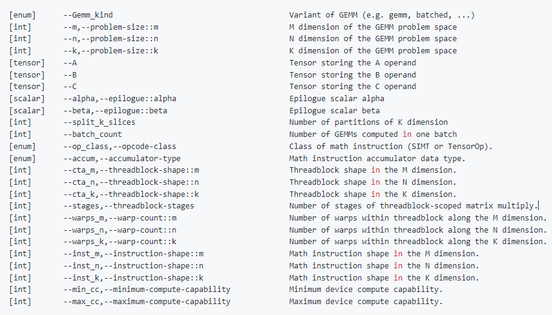

# 1. 环境

## 1.1 Prerequisites

```shell
$ git clone https://github.com/NVIDIA/cutlass
```

CUTLASS requires:

+ NVIDIA CUDA Toolkit (9.2 or later required, 11.1 recommended)
+ CMake 3.12+
+ host compiler supporting C++11 or greater (g++ 7.3.0 or Microsoft Visual Studio 2015 recommended)
+ Python 3.6+

CUTLASS may be optionally compiled and linked with

+ cuBLAS
+ cuDNN v7.6 or later

### 1.1.1 cmake

官方给出了建议的环境，cmake 没有安装，apt-get install 安装的是 3.12 版本，不符合要求。手动安装一下 3.20 cmake，[教程](https://gist.github.com/bmegli/4049b7394f9cfa016c24ed67e5041930)

注意有个 BUG，` Could NOT find OpenSSL,`，`apt-get install libssl-dev` 即可

### 1.1.2 gcc


## 1.2 Build

之后就可以 build 了。这里用 Turing 架构

Construct a build directory and run CMake.

```shell
$ export CUDACXX=${CUDA_INSTALL_PATH}/bin/nvcc

$ mkdir build && cd build

$ cmake .. -DCUTLASS_NVCC_ARCHS=75  # compiles for NVIDIA Turing GPU architecture
```

## 1.3 Build and run the CUTLASS Profiler

From the `build/` directory created above, compile the the CUTLASS Profiler. 主要是 build `build/tool/profiler` 目录。 :heavy_check_mark:

```shell
$ make cutlass_profiler -j12
```

Then execute the CUTLASS Profiler computing GEMM, execute the following command. :x:

这一步果然不行，cudaGetDeviceProperties() failed for given device，找不到 device

2022-05-08 14:41:46，:heavy_check_mark:，在工作站上就可以用 gpgpu-sim 运行，很奇怪，明明都是同一个 Docker 环境，只是自己电脑没有 GPU 而已

```shell
$ ./tools/profiler/cutlass_profiler --kernels=sgemm --m=4352 --n=4096 --k=4096

=============================
  Problem ID: 1

    Provider: CUTLASS
   Operation: cutlass_simt_sgemm_128x128_nn

 Disposition: Passed
      Status: Success

   Arguments:  --m=4352 --n=4096 --k=4096 --A=f32:column --B=f32:column --C=f32:column --alpha=1 --beta=0  \
               --split_k_slices=1 --batch_count=1 --op_class=simt --accum=f32 --cta_m=128 --cta_n=128 --cta_k=8  \
               --stages=2 --warps_m=2 --warps_n=2 --warps_k=1 --inst_m=1 --inst_n=1 --inst_k=1 --min_cc=50  \
               --max_cc=1024

       Bytes: 52428800  bytes
       FLOPs: 146064539648  flops

     Runtime: 10.5424  ms
      Memory: 4.63158 GiB/s

        Math: 13854.9 GFLOP/s
```

## 1.4 Build and run CUTLASS Unit Tests
### 1.4.1 Workspace
From the `build/` directory created above, simply build the target `test_unit` to compile and run all unit tests. :x:

这一步失败，看起来是 gcc 版本的问题。换了 gcc 版本，还是直接崩掉。


```shell
$ make test_unit -j
...
...
...
[----------] Global test environment tear-down
[==========] 946 tests from 57 test cases ran. (10812 ms total)
[  PASSED  ] 946 tests.
$
```

指定一个 unit，会 building 目录 `test/unit/gemm/warp/CMakeFiles` 中的内容，仍然是找不到 GPU Device ID

```shell
$ make test_unit_gemm_warp -j
```
### 1.4.2 工作站
**工作站：** 还是找不到 gpgpusim.config，这个应该找到对应的执行目录，把 config 文件复制过去即可。`cp ~/gpgpu-sim_distribution/configs/tested-cfgs/SM75_RTX2060/* ~/cutlass/build/test/unit/gemm/warp/CMakeFiles/test_unit_gemm_warp.dir/`

2022-05-09 15:31:59，猜测是在 `/cutlass/build/test/unit/gemm/warp` 目录下执行，把 gpgpusim.config 文件复制过去。:heavy_check_mark:

可以成功运行，新的问题是之前遇到的一个问题，wmma 指令的 align syntax 错误。
## 1.5 Profiler 和 Test Unit 的执行有什么区别？

## 1.6 gemm 运行参数

cutlass_profiler 支持非常自由的运行参数，并且支持参数的批处理（用 , 间隔）。参数如下，f32 应该就是对应的 data type 设置。

2022-05-09 20:34:24 找到了官方的 [Documentation](https://github.com/NVIDIA/cutlass#documentation)，可以看 Section 3 中的详细解释。

```shell
cutlass_profiler \
  --operation=Gemm \
  --m=8192 \
  --n=8192 \
  --k=8192 \
  --A=f32:column \
  --B=f32:column \
  --C=f32:column \
  --beta=0,1,2 \
  --profiling-iterations=1 \
  --providers=cutlass \
  --output=functional-test.csv
```

尝试修改 data type，是否有 i8? 这个语句执行结束后生成了一堆 .csv 文件，包括 conv2d, conv3d, gemm, rank_k, rank_2k，难道是一次执行了这么多程序？而且没有成功跑起来 :x:
```shell
$ ./tools/profiler/cutlass_profiler --kernels=cutlass_tensorop_s*gemm_f16_*_nt_align8 --m=3456 --n=4096 --k=4096 --A=i8:column --B=i8:column --C=i8:column --output=test.csv > ~/output/tensor_op3.log.lrr &
```

去掉 output 选项，data type 改成 f32

```shell
$ ./tools/profiler/cutlass_profiler --kernels=cutlass_tensorop_s*gemm_f16_*_nt_align8 --m=3456 --n=4096 --k=4096 --A=f32:column --B=f32:column --C=f32:column > ~/output/tensor_op3.log.lrr &
```
# 2. examples

使用官方 README.md 编译会因为没有 Device 而失败，那么换一个思路，尝试利用 cmake 编译运行 examples 中提供的文件。

## 2.1 cmake 编译流程

+ 编写CMakeLists.txt
+ 通过cmake生成Makefile
+ make编译

cuTLASS 在 `example` 目录下提供了 CMakeLists.txt。用法
+ 进入 example 目录，新建 build 文件夹；`$ mkdir build; cd build`
+ `cmake ../`; cmake会在找到上级目录找到CMakeLists.txt，生成makefile和一些其它文件
+ 在makefile所在目录，调用make命令，会根据makefile对程序进行编译生成。

# 3. Documentation

## 3.2 Functionality

这个部分介绍了 opcode class, ***data type**, layout. data type 正是我们所需要的。

opcode class, including Simt, TensorOp, SpTensorOp

### 3.2.2 Device-level Implicit GEMM convolution

列出了 Device-level Implicit GEMM convolution 的 opcode class, data type, layout

### 3.2.3 Warp-level Matrix Multiply with Tensor Cores

TensorOp 16-by-8-by-64. 支持 int4b_t，

### 3.2.4 Warp-level Matrix Multiply with CUDA WMMA API

WmmaTensorOp, 

Instruction Shape ( 16-by-16-by-16, 8-by-32-by-16)

Warp Shapes (32x32x16, 32x64x16, 64x32x16; 32x32x16, 32x64x16, 64x32x16)

## 3.3 Efficient GEMM in CUDA

### 3.3.1 Threadblock-level GEMM

Each threadblock computes its portion of the output GEMM by iteratively loading tiles of input matrices and computing an accumulated matrix product.

### 3.3.2 Warp-level GEMM

Multiple warps within a threadblock fetch data from shared memory into registers and perform computations. Warp-level GEMMs may be implemented either by TensorCores issuing mma.sync or wmma instructions or by thread-level matrix computations issued to CUDA cores. For maximum performance, access to shared memory should be bank conflict free. To maximize data reuse within the warp, a large warp-level GEMM tile should be chosen.

使用到了 wmma 指令，shared memory。

### 3.3.3 Thread-level GEMM

SGEMM, IGEMM, HGEMM, and DGEMM are computed by SIMT math instructions issued by thread-level matrix multiply procedures.

所以现在跑的是 thread-level GEMM

## 3.4 Terminology

Layout: functor mapping logical coordinates of a tensor to linear offset (as LongIndex); owns stride vectors, if any.

Operator: an object performing a computation on matrix or tensor objects. May be further refined by scope within the execution model hierarchy.

Tile: partitions of a tensor that have constant extents and layout known at compile time

## 3.5 CUTLASS Profiler :star:

The CUTLASS Profiler is a command-line driven test and profiling environment for CUTLASS computations defined in the CUTLASS Instance Library. The CUTLASS Profiler is capable of executing each GEMM, Sparse Gemm, Conv2d, and Conv3d kernel.

`cutlass_profiler` 就是一个封装好的脚本，运行各类程序

进入到目录 `build/tools/profiler`，运行 `cutlass_profiler --help` 可以查看一些有用的信息，直接 `cutlass_profiler --help` 找不到 cutlass_profiler；用 `./cutlass_profiler --help` 就开始跑程序了，有点不知道怎么用这个 --help。

2022-05-09 20:22:30，还是用 `./cutlass_profiler --help` 就可以跑，不过神奇的是这是用 gpgpu-sim 跑得，最后会把需要的信息 print 在屏幕上。

### 3.5.1 GEMM

The CUTLASS Profiler is capable of executing GEMM and Sparse GEMM problems.

#### 3.5.1.1 GEMM Arguments :star:

The complete set of arguments available to each operation may be viewed by specifying the operation name in addition to --help. The argument flags and their aliases usable for GEMM appear as follows.

可以通过 option `--help` 查看完整的  operation，他这里给出的例子是 `./tools/profiler/cutlass_profiler --operation=gemm --help`，所以还是得执行这个脚本吧。



#### 3.5.1.2 Example Tensor Core GEMM Operations

To execute kernels targeting Tensor Core operations, supply the flag `--op_class=tensorop` in the command line.

实际上，op_class 也就是选择 TensorOp or SIMT

```shell
$ ./tools/profiler/cutlass_profiler --op_class=tensorop --m=3456 --n=4096 --k=8192
```

#### 3.5.1.3 自己运行

```shell
./tools/profiler/cutlass_profiler --operation=Gemm --op_class=tensorop --m=1024 --n=1024 --k=128 --inst_m=8 --inst_n=8 --inst_k=32
```

**如何使用 4-bit 进行计算**: 对于 TensorOp, Instruction Shape 8-by-8-by-32 对应的是 A-int4b_t, B-int4b_t, C-int32_t，通过参数 `--inst_m`, `--inst_n`, `inst_k` 来决定

### 3.5.2 Conv

和 gemm 也是类似的，重点还是搞懂他们的参数。
