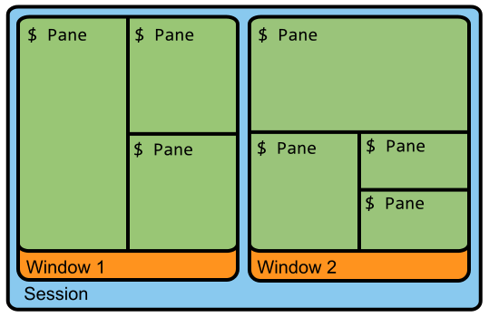

## 0. 前言

个人理解：最重要的思想感觉是将 session 和终端分离，这样的话退出终端时不会中断 session 以及里面的任务，session 还是在后台运行。最重要的是，下次进入终端时可以连接 session，使得可以还原上一次退出时的状态，且后台任务不会中断。

前缀键：Ctrl + B，用`<prefix>`表示。比如`<prefix> %`表示先按`Ctrl`，再按`B`键，再`%`键，其完成的功能就是竖直分屏。

### 0.1 安装、启动、退出

```shell
$ sudo apt-get install tmux
$ tmux #进入 Tmux 窗口，底部状态栏左侧是窗口信息（编号和名称），右侧是系统信息
$exit #或者 ctrl + d，退出
```

## 1. 基本概念



### 1.1 Session

会话(session): 建立一个 tmux 工作区会话，会话可以长期驻留，重新连接服务器不会丢失，我们只需重新 tmux attach 到之前的工作区就可以恢复会话

Session 一大特点：打开窗口，会话开始；关闭窗口，会话结束，会话内部的进程也随之结束

基于这个 Motivation，为了解决这种关闭窗口工作丢失的问题，会话和窗口可以解绑。窗口关闭时，会话并不会终止，而是继续运行，有需要的时候（理解为需要交互的时候）再让会话绑定其他窗口。

窗口(window): 容纳多个窗格

窗格(pane): 可以在窗口中分成多个窗格

### 1.2 Tmux

Tmux 就是让会话与窗口解绑的工具

+ 可以在单个窗口中同时访问多个会话。对于同时运行多个命令行程序很有用
+ 可以让新窗口 接入 已存在的会话
+ 允许每个会话有多个连接窗口，可以多人实时共享会话
+ 支持窗口任意的垂直和水平拆分

## 1. Session

### 1.1 new

第一个启动的 Tmux 窗口，编号是`0`，第二个窗口的编号是`1`，以此类推。这些窗口对应的会话，就是 0 号会话、1 号会话。

> 这里指的是不同会话的窗口？

使用编号区分会话，不太直观，更好的方法是为会话起名。

```text
$ tmux new -s <session-name>
```

上面命令新建一个指定名称的会话。

### 1.2 Detach

在 Tmux 窗口中，按下`<prefix> d`或者输入`tmux detach`命令，就会将当前会话与窗口分离。

```shell
$ tmux detach
```

上面命令执行后，就会退出当前 Tmux 窗口，但是会话和里面的进程仍然在后台运行。

### 1.3 查看会话

`tmux ls`命令可以查看当前所有的 Tmux 会话。

```shell
$ tmux ls
# or
$ tmux list-session
```

### 1.4 Attach, Kill, Switch

`tmux attach`命令用于重新接入某个已存在的会话。

`tmux kill-session`命令用于杀死某个会话。

`tmux switch`命令用于切换会话。

`tmux rename-session`命令用于重命名会话。

```shell
# 使用会话编号
$ tmux attach -t 0
$ tmux kill-session -t 0
$ tmux switch -t 0
# 使用会话名称
$ tmux attach -t <session-name>
$ tmux kill-session -t <session-name>
$ tmux switch -t <session-name>

#重命名
$ tmux rename-session -t 0 <new-name>
```

## 2. 快捷键

### 2.1 Session

下面是一些会话相关的快捷键。

- `<prefix> d`：分离当前会话。
- `<prefix> s`：列出所有会话。
- `<prefix> $`：重命名当前会话。

### 2.2 Window

- `<prefix> c`：创建一个新窗口，[状态栏](https://www.zhihu.com/search?q=状态栏&search_source=Entity&hybrid_search_source=Entity&hybrid_search_extra={"sourceType"%3A"article"%2C"sourceId"%3A261206348})会显示多个窗口的信息。
- `<prefix> p`：切换到上一个窗口（按照状态栏上的顺序）。
- `<prefix> n`：切换到下一个窗口。
- `<prefix>`：切换到指定编号的窗口，其中的``是状态栏上的[窗口编号](https://www.zhihu.com/search?q=窗口编号&search_source=Entity&hybrid_search_source=Entity&hybrid_search_extra={"sourceType"%3A"article"%2C"sourceId"%3A261206348})。
- `<prefix> w`：从列表中选择窗口。
- `<prefix> ,`：窗口重命名。

## 3. 常用

### 3.1 翻屏

- 进入tmux翻屏模式:先按`ctrl ＋ｂ`，松开，然后再按`[`
- 操作同vim：jkhl上下左右

### 3.2 最简操作

1. 新建会话`tmux new -s my_session`。
2. 在 Tmux 窗口运行所需的程序。
3. 按下快捷键 d 将会话分离。
4. 下次使用时，重新连接到会话`tmux attach -t my_session`。

## 4. 设置

### 4.1 启用鼠标滚轮

Ctrl + b，然后输入

```shell
$ setw mode-mouse on
```


# Reference

https://zhuanlan.zhihu.com/p/261206348
