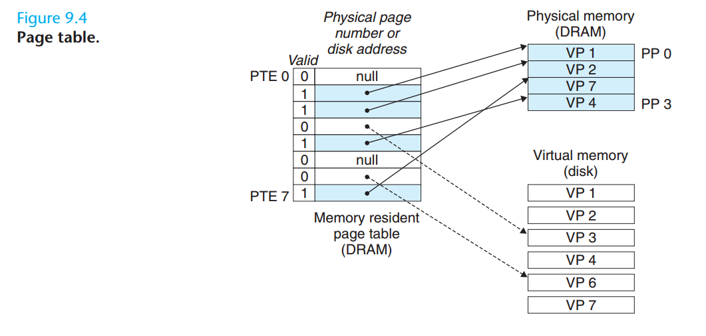
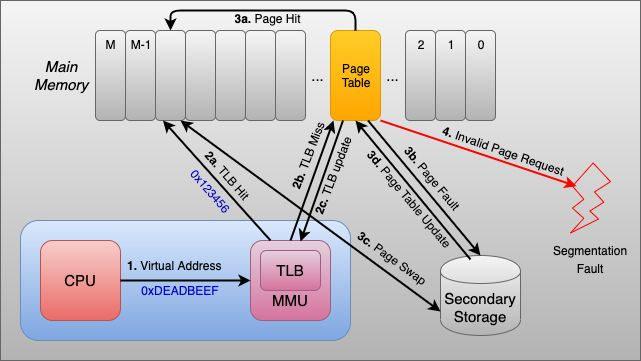

# 0. 前言

最近刚把 adaptive 调度的一部分工作写成了文章，在 SOCC DDL（4.14） 投了出去。之后会准备oneflow面试，如果可以拿下这份远程实习，对工程能力和并行计算优化方面会有更好的优化。因此，希望可以好好准备一下oneflow二面。准备的方式就是浏览一遍CSAPP，一方面是复习体系结构中的一些知识，另一方面再构建一下对整个计算机结构，操作系统，C语言的了解和认识。

## 0.1 知识点挖坑

+ 浮点数的表示

+ 流水线的设计（第四章）

## 1.2

预处理：把 # 开头的一些代码替换成对应的内容，比如 `#include<stdio.gh>`, `#define`，或者是之前见过的，别人写代码时用到的宏定义来代替 for 循环等操作。hello.c -> hello.i

编译器：得到汇编语言，也就是各种指令。生成 hello.s (s 代表 assembly？)

汇编阶段：translate assembly to machine code.

链接：合并，比如 hello 程序调用了 printf 函数，which is in `printf.o`，链接器（ld）负责做这种合并

大型项目往往会出现和链接器相关的错误。比如你定义了2个名字相同的全局变量，静态库和动态库区别？第七章会介绍

### 1.4.1 系统的硬件组成

这里有描述架构和微架构的区别

> 指令集架构描述的是每条机器代码指令的效果；微体系结构（微架构）描述的是处理器实际上是如何实现的。

### 1.4.1 运行 hello 程序

DMA，data 不通过处理器，直接从磁盘到达主存

## 1.5 Cache 至关重要

cache，SRAM

## 1.7 OS管理硬件

两个基本功能：防止硬件被失控的应用程序滥用；向application提供简单一致的机制来控制复杂而大不相同的低级硬件设备

PS: 硬件设备的架构、配置各不相同，而OS正是这样的一个接口。

### 1.7.1 进程（process）

OS 跟踪 进程 运行需要的所有状态信息，这种状态称为**上下文**，包括 PC，register file。

上下文切换：OS 决定把控制权转移到另一个进程，进行上下文切换

PS：从微架构来理解，其实就是执行的下一条指令PC以及数据（来自register file）换掉了，换成了OS层面的另一个进程。

### 1.7.2 线程

这个是OS中的线程概念，一个进程由多个线程的执行单元组成

### 1.7.3 虚拟内存 :star:

抽象概念，为每个进程提供独占DRAM的假象。

" align=left"

从下到上（低地址向高地址）：

+ 代码和数据： 所有进程代码都是从同一固定地址开始。之后是存放全局变量的位置。

+ 堆：malloc, free 这种标准库函数来进行申请，程序员来管理

+ 共享库：存放C标准库，数学库。第七章动态链接部分会介绍。

+ 栈：编译器管理，实现函数调用

+ 内核虚拟内存：application 无法直接调用，必须调用kernel来执行

### 1.9.1 Amdahl's Law

HPC，并行加速

## 2.1 信息存储

浮点数：以2为基数的科学计数法。

### 2.1.2 字数据大小

字长（word size）决定虚拟地址空间的最大大小。对于字长 $w$，虚拟地址的范围为 0~$2^w-1$。近几年64位字长的机器比较多，32位字长使得虚拟地址空间为4GB。大多数64位机器可以运行32位机器编译的程序，向后兼容性。

### 2.1.3 寻址和字节顺序

这里面比较重要的知识是大端小端。

知识前提：多字节对象（比如一个int）被存储为连续的字节序列。假设一个 int 型变量 x，取地址为 0x100，int 32bit，4 字节，实际上他的 4 个字节存储在 0x100, 0x101, 0x102, 0x103，这个是还未对齐到 cache line 的，每个字节的地址。

假设 x = 0x01234567

小端就是最低有效字节（67）在 0x100 地址处

" align=left"

反汇编（disassembler）：确定可执行文件所表示的指令序列。

typedef 给数据命名，主要是改善代码可读性。

```c
typedef int *int_pointer;
int_pointer ip; 
```

不过这个*为什么是和 int_pointer 挨在一起的？

### 2.1.7 位运算

这个自己编程时用的比较少

与运算：$\&$

或运算：$|$

NOT，取反：$~$ `~0x41`

## 2.2

介绍一些补码，无符号数，有符号数

2.3 阐述整数运算

## 2.4 浮点数

### 2.4.2 IEEE浮点表示

尾数（significand）：一个二进制小数

阶码（exponent）：浮点数加权。

# 3. 程序的机器级表示

### 3.2.1 机器级代码

大概讲一讲汇编代码，指令的编码格式，执行流程，关于控制的条件码

## 3.7 过程

运行时栈

### 3.7.4 栈上的局部存储

有时，寄存器不足够存放所有的本地数据，对于GPU会把这部分数据放入local memory

### 3.10.1 理解指针

# 4. 处理器体系结构

## 4.1 Y86-65 指令集体系结构

介绍指令集架构，指令，RISC，CISC

## 4.2 逻辑设计和硬件控制语言 HCL

最常用的是 Verilog，描述电路的语言。

设计逻辑门，组合逻辑电路，布尔表达式，存储器，时钟（CLK）

很多的逻辑门组合成一个网，就能构建计算块(computational block)，称为组合电路(combinational circuits)。构建这些网有两条限制：

+ 两个或多个逻辑门的输出不能连接在一起。否则它们可能会使线上的信号矛盾，可能会导致一个不合法的电压或电路故障
+ 这个网必须是无环的。也就是在网中不能有路径经过一系列的门而形成一个回路，这样的回路会导致该网络计算的函数有歧义。

## 4.3 Y86-65 的顺序实现

介绍了几个 pipeline stage, fetch, decode, excute, memory, write back, PC update

## 4.4 流水线的通用原理

介绍流水线如何缩短执行所需的 cycle

流水线会有一些**局限性**：不同逻辑单元的时钟周期并非完全一致的。流水线过深会造成收益下降。

## 4.5 Y86-64 的流水线实现

设计分支预测，data hazard, control hazard, structure hazard。主要是关于几个 hazard，以及处理方式，比如 stall, forward（转发）。

什么是结构危害？

当硬件不能在重叠执行中同时支持所有可能的指令组合时，资源冲突就会引起**结构性危险**。在现代处理器中，结构性危害主要发生在不常用的特殊功能单元中（例如浮点除法或其他复杂的长期运行指令）。这个没有 data hazard and control hazard 常见。

还涉及异常处理

### 4.5.8 流水线控制逻辑

发现特殊控制条件，流水线控制机制，控制逻辑实现

### 4.5.9 性能分析

其实就是 IPC 和 CPI

## 5. 优化程序性能

编写高效的程序：适当的算法和数据结构；编写编译器能够有效优化以转换成高效可执行代码的源码，这一点就要求比较了解和编译器相关的知识；利用并行性。

## 5.1 优化编译器的能力和局限性

`-O2 -O3` 级别的优化可以进一步提高程序的性能，但是也可能增加程序的规模。

阻碍优化的因素：

+ 阐述了两个指针可能指向同一个内存位置的情况，这个被称为**内存别名使用**(memory aliasing)

+ 函数调用，函数可能会有副作用（改变全局程序状态的一部分）

大部分编译器不会判断函数是否偶副作用。可以用 inline function 替换来优化函数调用

gcc不是最好的编译器，但对于大部分人已经足够用。

## 5.2 表示程序性能

> 我们引入度量标准每元素的周期数(Cycles Per Element, CPE)作为一种表示性能并指导我们改进代码的方法。处理器活动的顺序是由时钟控制的，时钟提供了某个频率的规律信号，通常用千兆赫兹(GHz)，即十亿周期每秒来表示。CPE 越小越好。

## 5.4 消除循环的低效率

最常见的就是把函数调用放到 loop 之外，比如我之前编程时很喜欢写 

```c++
for(int i=0; i < vec.size(); i++)
```

这样会大量调用 size() function，可以做如下优化

```c++
int len = vec.size();
for(int i=0; i < len; i++)
```

以上的代码移动(code motion)是一种优化。这类优化包括识别要执行多次(例如在循环里)但是计算结果不会改变的计算。因而可以将计算移动到代码前面不会被多次求值的部分。

## 5.5 减少过程调用

> 过程调用会代码相当大的开销，而且妨碍大多数形式的程序优化。我们可以直接访问数组，而不是利用函数调用并加上边界检查。

也就是说去掉不必要的一些边界检查。

## 5.6 消除不必要的内存引用

比如无需每次都把结果写入 dest，可以使用一个临时变量，消除不必要的存储器引用

## 5.7 理解现代处理器

提到了 superscaler，OoO，分支预测。大概是介绍这类技术

## 5.8 循环展开

> 循环展开是一种程序变换，通过增加每次迭代计算的元素的数量，减少循环的迭代次数。其思想是在一次迭代中访问数组并做乘法，这样得到的程序需要更少的迭代，从而降低循环的开销。

PS：这个应该是和最基础的并行思想想结合。

## 5.9 提高并行性

多个积累变量；重新结合变换；这就涉及到 SIMD

## 5.11 一些限制因素

寄存器溢出；分支预测和预测错误处罚；Amdahl定律

## 5.12 理解内存性能

这个就是研究 load/store 的影响，也就是 cache 

## 5.13 应用：性能提高技术

高级设计：为遇到的问题选择适当的算法和数据结构。

基本编码原则：消除连续的函数调用；消除不必要的内存引用；

低级优化：展开循环；SIMD；

## 5.14 确认和消除性能瓶颈

也就是常说的 profiling 技术，code profiler。

最基础的就是插入工具代码，确定程序的各个部分需要多少时间。

# 6. 存储器层次结构（memory system）

## 6.1 存储技术

RAM，Random-Access-Memory，分为 SRAM，DRAM。

SRAM：每个 bit 存在一个双稳态（bitstable）存储器单元。只有两个稳定的配置（configuration）或者状态（state）

DRAM：DRAM相比SRAM，对干扰非常敏感。内存系统必须周期性地读出，然后重写来刷新每一位。

NVM（Non-Volatile Memory）：闪存（flash memory），新型的基于闪存的磁盘驱动器，SSD（Solid State Disk）

Cache 的一些基本信息。

# 7. 链接

链接：将各种代码和数据和数据片段收集并组合成为一个单一文件的过程，这个文件可以被**加载**（复制）到内存并执行。链接可以执行与 compile time, load time, run time.

PS：链接在大型工程项目编译时应该很重要，可以避免对一些源代码文件的重复编译。

大多数编译系统提供编译驱动程序（compiler driver），为用户根据需求调用语言预处理器、编译器、汇编器和链接器。

## 7.2 静态链接

为了创建可执行文件，链接器必须完成两个主要任务：

+ 符号解析（symbol resolution），将一个符号引用和一个符号定义结合起来
+ 重定位（relocation），编译器和汇编器生成从地址 0 开始的代码和数据节。链接器通过把每个符号定义域一个存储器位置联系起来，然后修改所有对这些符号的引用，使得它们指向这个存储器位置，从而重定位这些节。

目标文件纯粹是字节块的集合。这些块中，有些包含程序代码，有些则包含程序数据，而其他的则包含指导链接器和加载器的数据结构。链接器将这些块连接起来，确定被连接块的运行时位置，并且修改代码和数据块中的各种位置。链接器对目标机器了解甚少。产生目标文件的编译器和汇编器已经完成了大部分工作。

## 7.3 目标文件

目标文件有三种形式：

+ 可重定位目标文件，包含二进制文件和代码，其形式在编译时和其他可重定位目标文件合并起来，创建一个可执行目标文件
+ 可执行目标文件，其形式可被拷贝到存储器并执行
+ 共享目标文件，一种特殊类型的可重定位目标文件，可以在加载或者运行时被动态地加载到存储器并链接。

编译器和汇编器生成可重定位目标文件（包括共享目标文件），链接器生成可执行目标文件

## 7.10 动态共享链接库

共享库(shared library)是致力于解决静态库缺陷的一个现代创新产物。共享库是一个目标模块，在运行时，可以加载到任意的存储器地址，并和一个在存储器中的程序链接起来。这个过程称为动态链接(dynamic linking)，是由一个叫做动态链接器的程序来执行的。

共享库也称为共享目标(shared object)，在 Unix 系统中通常用 .so 后缀来表示。微软的操作系统大量地利用了共享库，它们称为 DLL。

动态链接库和静态链接库的区别：

关于静态库

+ 静态库对函数库的链接是放在编译时期完成的。

+ 程序在运行时与函数库再无瓜葛，移植方便。

+ 浪费空间和资源，因为所有相关的目标文件与牵涉到的函数库被链接合成一个可执行文件。

**为什么需要动态库？**

空间浪费是静态库的一个问题。

另一个问题是静态库对程序的更新、部署和发布页会带来麻烦。如果静态库liba.lib更新了，所以使用它的应用程序都需要重新编译、发布给用户（对于玩家来说，可能是一个很小的改动，却导致整个程序重新下载，全量更新）。

**动态库特点**

+ 动态库在程序编译时并不会被连接到目标代码中，而是在程序运行是才被载入。

+ 不同的应用程序如果调用相同的库，那么在内存里只需要有一份该共享库的实例，规避了空间浪费问题。

+ 动态库在程序运行是才被载入，也解决了静态库对程序的更新、部署和发布页会带来麻烦。用户只需要更新动态库即可，增量更新。

# 8. 异常控制流

这部分后面有需要再看

> 处理器按照一定的序列的地址执行对应的指令，从这一个地址过渡到下一个地址成为控制转移，这样的控制转移序序列称为处理器的控制流（flow control）

> 系统必须能够对系统状态的变化做出反应，这些系统状态不是被内部程序变量捕获的，而且也不一定要和程序的执行相关。比如，一个硬件定时器定期产生信号，这个事件必须得到处理。当子进程终止时，创造这些子进程的父进程必须得到通知。

> 线代系统通过使控制流发生突变来对这些情况做出反应。一般而言，我们把这些突变称为异常控制流(Exceptional Control Flow, ECF)。异常控制流发生在计算机系统的各个层次。比如，在硬件层，硬件检测到的事件会触发控制突然转移到异常处理程序。在操作系统层，内核通过上下文转换将控制从一个用户进程转移到另一个用户进程。在应用层，一个进程可以发送信号到另一个进程，而接受者会将控制突然转移到它的一个信号处理程序。一个程序可以通过回避通常的栈规则，并执行到其他函数中任意位置的非本地跳转来对错误做出反应。

# 9. 虚拟内存

虚拟内存这一块工作，以及请求到下级缓存之后的知识完全不solid，这也间接导致了商汤，平头哥的面试出现重大问题。在和 Xia 的交流中，这是一个潜在的研究方向。既是补短板，也是打基础。

# 9.1 物理和虚拟寻址

物理寻址：理解为类似直接映射的方式。

虚拟寻址：请求中包含的是一个 VA（virtual memory），经过 MMU 进行 address translation 后得到 PA（physical address），此时去 Main memory 寻址。

# 9.3 虚拟内存作为缓存的工具

VM 系统将虚拟内存分割为大小固定的块，称为虚页（virtual page, VP）。类似地，物理内存被分割为物理页（physical page, PP）。

在任意时刻，虚拟页面的集合部分都分为三个不相交的子集：

+ 未分配的：VM 系统还未分配(或者创建)的页。未分配的块没有任何数据和它们相关联，因此也就不占用任何磁盘空间。
+ 缓存的：当前缓存在物理存储器中的已分配页。
+ 未缓存的：没有缓存在物理存储器中的已分配页。

### 9.3.1 DRAM高速缓存的组织结构

在存储层次结构中，DRAM缓存的位置对于他的组织结构有很大的影响。DRAM 缓存的组织结构完全是由巨大的不命中开销（large overhead）驱动的。

因为大的不命中处罚和访问第一字节的开销，虚拟页往往很大，典型地是4KB-2MB。

由于大的不命中处罚，DRAM 缓存是全相连的，也就是说，任何虚拟页都可以放置在任何的物理页中。不命中时的替换策略也很重要，因为替换错了虚拟页的出发也非常高。因此，与硬件对 SRAM 缓存相比，操作系统对 DRAM 缓存使用了更复杂精密的替换算法。最后，因为对磁盘的访问时间很长，DRAM 缓存总是使用写回(write back)，而不是直写。

PS：也就是说虚拟页采用的是写回的替换策略。

### 9.3.2 页表

同任何缓存一样，虚拟存储器系统必须有某种方法来判定一个虚拟页是否存放在 DRAM 中的某个地方。如果是，系统还必须确定这个虚拟页存放在哪个物理页中。如果不命中，系统必须判断这个虚拟页存放在磁盘的哪个位置，在物理存储器中选择一个牺牲页，并将虚拟页从磁盘拷贝到 DRAM 中，替换这个牺牲页。

PS：这个和 cache 的逻辑其实是类似的。页是访问的最小单位

这些功能是由许多软硬件联合提供的，包括操作系统软、MMU(存储器管理单元)中的地址翻译硬件和一个存放在物理存储器中叫做页表(page table)的数据结构，页表将虚拟页映射到物理页。每次地址翻译硬件将一个虚拟地址转换为物理地址时都会读取页表。操作系统负责维护页表的内容，以及在磁盘与 DRAM 之间来回传送页。

下图展示了一个页表的基本组织结构。**页表**就是一个页表条目(Page Table Entry, PTE)的数组。虚拟地址空间中的每个页在页表中一个固定偏移量处都有一个 PTE。

<div align=left>

</div>


### 9.3.3 页命中

### 9.3.4 缺页

在虚拟存储器的习惯说法中，DRAM不命中称为缺页（page fault）。缺页异常调用内核中缺页异常处理程序，该程序会选择一个牺牲页。在磁盘和存储器之间传送页的活动叫做交换(swapping)或者页面调度(paging)。

PS：那就和 cache miss, cache replacement 类似。DRAM 提供不了，需要找 disk 去要数据

### 9.3.6 局部性再次搭救

尽管在整个运行过程中程序引用的不同页面的总数可能超出物理存储器总的大小，但是局部性原则保证了在任意时刻，程序往往在一个较小的活动页面(active page)集合上工作，这个集合叫做工作集(working set)或者常驻集(resident set)。

如果工作集的大小超出了物理存储器的大小，那么程序将产生一种不幸的状态，叫做颠簸（thrashing），这时页面将不断的换进换出。

PS：这些概念和 cache 都是类似的。

## 9.6 Address Translation

虚拟地址有两段信息，**虚拟页号** 以及 **虚拟页偏移量**，通过虚拟页号查询**页表**得到物理页号，物理页偏移和虚拟页偏移对应。

### 9.6.2 利用TLB加速地址翻译

TLB 是什么？TLB是一个小的、虚拟地址的缓存，其中每一行都保存着一个由单个PTE组成的块。TLB通常有高度的相连性。

PS：也就是快速地查找 虚拟页表 到 物理页表 的映射。

下图的描述很清晰，仔细去看 1,2,3 过程。

<div align=left>

</div>


### 9.6.3 多级页表

PS：这个是平头哥面试过程中没有回答出来的部分。对于页表概念的空白，一部分原因应该是对OS的掌握不够。

为什么需要用到多级页表？得先了解一级页表的缺陷，一级页表的地址必须指向确定的物理页，否则就会出现错误，所以如果用一级页表的话，就必须把全部的页表都加载进去。

假设虚拟地址空间为32位（即4GB），每个页面映射4KB以及每条页表项占4B：

+ 一级页表：进程需要1M个页表entry（4GB / 4KB = 1M, 2^20个页表项），即页表（每个进程都有一个页表）占用4MB（1M * 4B = 4MB）的内存空间。
+ 二级页表：一级页表映射4MB（2^22）、二级页表映射4KB，则需要1K个一级页表项（4GB / 4MB = 1K, 2^10个一级页表项）、每个一级页表项对应1K个二级页表项（4MB / 4KB = 1K），这样页表占用4.004MB（1K * 4B + 1K * 1K * 4B = 4.004MB）的内存空间。

>多级页表的内存空间占用反而变大了。但是二级页表可以不存在，二级页表可以存在但不存在主存。
>
>做个简单的计算，假设只有20%的一级页表项被用到了，那么页表占用的内存空间就只有0.804MB（1K * 4B + 0.2 * 1K * 1K * 4B = 0.804MB），对比单级页表的4M是不是一个巨大的节约？
>
>那么为什么不分级的页表就做不到这样节约内存呢？我们从页表的性质来看，保存在主存中的页表承担的职责是将虚拟地址翻译成物理地址；假如虚拟地址在页表中找不到对应的页表项，计算机系统就不能工作了。所以页表一定要覆盖全部虚拟地址空间，不分级的页表就需要有1M个页表项来映射，而二级页表则最少只需要1K个页表项（此时一级页表覆盖到了全部虚拟地址空间，二级页表在需要时创建）。


PS：讲一下个人理解。每个process有4GB虚拟地址空间，因为程序的虚拟地址可能是4GB中的任意一个字节。一级页表覆盖了整个4GB的虚拟地址空间，但是如果某个一级页表没有被用到，那么就无需创建这个页表项对应的二级页表，可以在需要时再创建二级页表。

## 9.9 动态内存分配

这部分和OS以及编程中的内存管理相关。

显式分配：比如malloc, free, new, delete

隐式分配：分配器检测一个已分配的块何时不再被程序所使用，那么就释放这个块。

垃圾回收（GC, Garbage Collection）：自动释放未使用的已分配的块。一些高级语言会依赖于GC来释放已分配的块，比如 Lisp, ML, JAVA

# 10. 系统级IO

将一些输入输出，打开/读取文件，重定向

# 11. 网络编程

IP, Socket, Web 服务器, HTTP。

PS：这部分自己不是很熟

# 12. 并发编程

竞争，死锁
