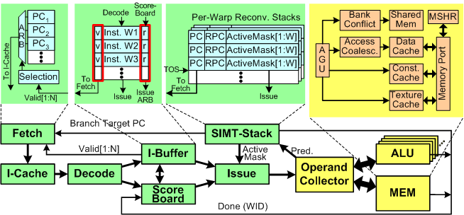
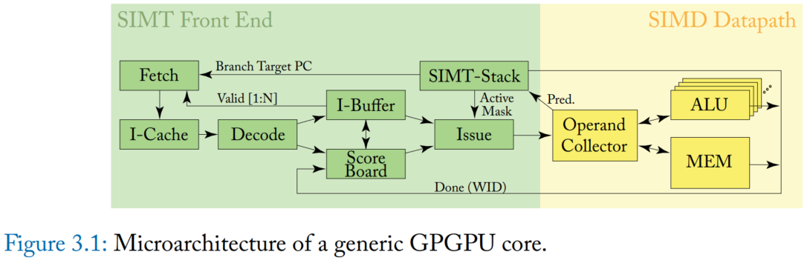
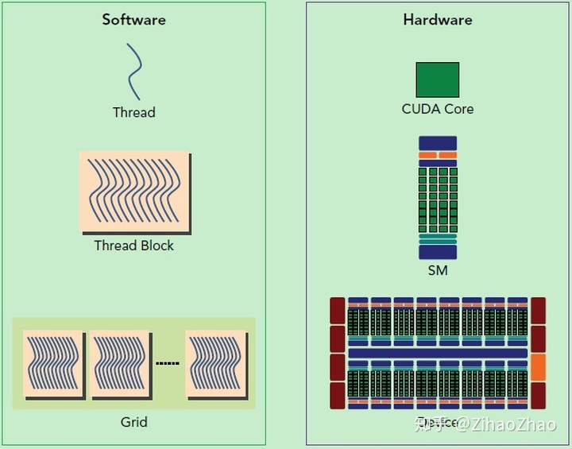
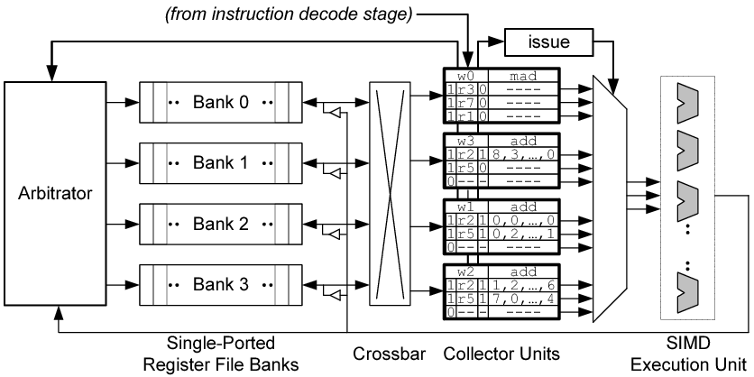
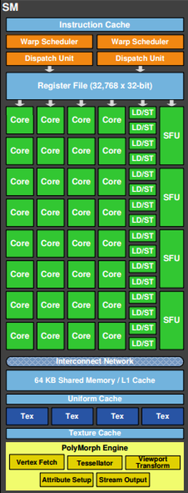
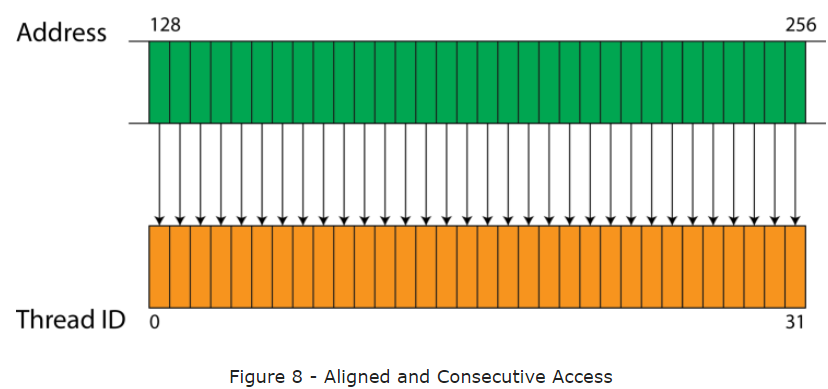

# 0. 前言

搞懂 SIMT Core 对于理解 GPGPU 的指令 fetch、指令发射、内存访问、数据传输等步骤非常重要，按照 GPGPU-Sim 的官方文档进行一个简单的梳理

SIMT Core 的微架构模型中有几个比较重要的硬件单元，接下来会一一介绍他们的作用，

# 000 放一个硬件概念对应表

# 1. Front End

+ Instruction cache access
+ Instruction buffer logic
+ Scoreboard
+ Scheduling logic
+ SIMT stack

## 1.1 Fetch and Decode

这里介绍整个指令 Fetch and Decode 阶段，涉及到的硬件单元主要是 Fetch, I-Cache, Decode, I-Buffer, ScoreBoard

##### I. Fetch

Fetch 单元是一个调度器，作用

+ 根据 PC 的值，从 I-Cache 中取指令，即发送内存请求。

对于一个 warp，如果在 I-Buffer 中没有任何 valid 指令 (valid bit 作用在 III. I-Buffer 中有介绍)，那么这个 warp 就可以进行 instruction fetch。

默认情况下，一个 warp 的**两条**连续的指令被取出。

当 Fetch 取到一个 warp 的指令，I-Buffer 中对应的 entry 有效位置为1， 直到该 Warp 的所有指令均执行完毕。

##### II. Decode, I-Buffer

一条指令从 instruction cache fetch 出来后会进行解码，然后存入 instruction buffer (I-Buffer)。每个 warp 有两个 I-Buffer entry, I-Buffer entry 的信息如下

+ Valid bit (1 bit): Valid bit 为1表示这个 warp 在 I-Buffer 中还存在未发射的指令
  + Valid bit 主要是和 Fetch 单元进行交互，如果一个 warp 在 I-Buffer 中还有未发射的指令，那么就不会进行指令 fetch 的操作
+ Ready bit (1 bit): Ready bit 为1表示这个 warp 的这条指令已经可以发射到 execution pipeline, 具体何时发射由 warp scheduler 以及调度策略决定
  + 是否 Ready 由 Scoreboard, Operand Unit 等决定
+ I-Buffer entry 中还存有解码后的指令 (decoded instruction) 信息

Decode 单元一次解码2条指令，解码后的指令 fill 到 I-Buffer 中

##### III. I-Cache

指令 cache 是 read-only, non-blocking set-associative cache, 可以使用 FIFO 或是 LRU 替换策略，以及 on-miss 或是 on-fill 分配策略。对 I-Cache 的请求会导致3种状态, hit, miss or reservation fail. 

+ 如果 未命中状态保持寄存器 (MSHR) 已满或者 cache set 中没有可替换的块，则会导致 reservation fail，因为所有 block 都由先前的 pending request 保留 (细节在2.3.4的 cache 部分)。

在 hit 和 miss 情况下，轮询 fetch 调度器都会移动到下一个 warp。

+ 对于 hit, fetched 指令送到 decode stage. 开始解码
+ 对于 miss, 指令 cache 会产生一个请求。
  + 当接收到 miss response, cache block 会填入指令 cache, warp 会再次访问指令 cache. 
  + 当 miss 仍在等待 (pending), warp 不会访问指令 cache

> 这一点对应源码 hader_core_ctx::fetch 函数中，需要 access_ready 才访问指令 cache，否则就去找下一个 I-Buffer 有空间、指令 cache 没有等待 Miss 等待的 active warp

如果 warp 的所有线程都已完成执行而没有任何 outstanding stores or pending writes to local registers, 则 warp 执行完成并且不再被 fetch 调度器考虑。

在 decode stage, 最近 fetched 指令会被解码并存入相应的 I-Buffer entry 等待被发射。

## 1.2 Instruction Issue

第二个轮询调度器 (issue 单元) 选择 I-Buffer 中的一个 warp 将其发射到流水线。这个轮询调度器 (issue) 和用于调度指令 cache 访问的轮询调度器 (fetch) 分离。发射调度器可以配置，每周期发射同一 warp 的多条指令。当前检查的 warp 中的每条 valid 指令 (解码后未发射的指令) 满足以下条件时有资格被发射 (eligible warp)

+ warp 没有在等待 barrier
+ I-Buffer 中有有效指令 (valit bit is set)
+ 通过了 scoreboard 检查
+ 指令流水线的操作数访问阶段 (operand stage) 没有 stall

内存指令 (Load, store, memory barriers) 发射到内存流水线。其他指令可以使用 SP 和 SFU 流水线，不过一般常去 SP 流水线。然而，如果有 control hazard, I-Buffer 中的指令会被刷掉 (flush). 发射指令到流水线后更新 warp 的 PC，将其指向下一条指令 (假设所有分支 not-taken). 下一节1.3会介绍更多 control hazard 的细节

> GPU 是有内存流水线和 ALU 流水线的，两种类型的指令由不同的硬件单元执行

在 issue stage 会执行 barrier 操作。同样，会更新 SIMT stack 以及追踪寄存器依赖 (scoreboard). warp 在 issue stage 会等待 barrier (`__syncthreads()`)

> CUDA 编程中常用这个 barrier, 等待所有游客 (thread) 到齐了再开大巴

## 1.3 SIMT Stack

SIMT Stack 是每个 warp 都有的资源。SIMT Stack 用于处理 SIMT 架构的分支问题 (branch divergence). 因为 GPU 中分支会降低 SIMT 架构的效率，所以有很多降低分支危害的技术。其中最简单的技术是 post-dominator stack-based reconvergence mechanism. 这个技术在最早的保证聚合点 (guaranteed reconvergence point) 同步分支以提高 SIMT 架构的效率。GPGPU-Sim 3.x 使用了这个机制。

SIMT Stack entry 代表不同的分支等级。在每遇到一个分支，一个新的 entry 入栈。到达聚合点时栈顶 entry 出栈。每个 entry 存储新分支的 target PC、the immediate post dominator reconvergence PC (也就是聚合点 PC) 以及发散到该分支的线程的活动掩码 (active mask). 在这个模型中，每个 warp 的 SIMT Stack 在每条指令发射后更新。

+ 没有分支的 target PC 会正常更新为 next PC.
+ 有分支的情况下，会入栈新的 target PC、相应的线程 active mask、the immediate post dominator reconvergence PC

**因此，如果 SIMT Stack 栈顶的 next PC 不等于当前正在检查的指令的 PC，则检测到 control hazard。 (也就是说会发生跳转)**

NVIDIA and AMD 实际上使用特殊指令修改了他们的 divergence stack 的内容。这些 divergence stack 指令未在 PTX 中公开，但在实际硬件 SASS 指令集中可见（使用 decuda 或 NVIDIA 的 cuobjdump 可见）。 当当前版本的 GPGPU-Sim 3.x 被配置为通过 PTXPlus 执行 SASS（参见 PTX 与 PTXPlus）时，它会忽略这些低级指令，而是创建一个类似的控制流图来识别 immediate post-dominators。 我们计划在 GPGPU-Sim 3.x 的未来版本中支持低级分支指令的执行。

## 1.4 Scoreboard

Scoreboard 算法检查 WAW 和 RAW 依赖。在发射阶段会保留 warp 写的寄存器。Scoreboard 算法通过 warp ID 进行索引。它将使用到的寄存器存入与 warp ID 相应的 entry 中。保留的寄存器在写回阶段被释放。

之前提到，一个 warp 的解码指令在 Scoreboard 判断其没有 WAW 和 RAW 危害后才可以被调度发射。而 Scoreboard 追踪寄存器，这些寄存器会被一条已经发射的指令写，但是还未将结果写回寄存器文件，以此来检测 WAW 和 RAW 危害。

# 2. Register Access and the Operand Collector

许多 NVIDIA 的专利描述了一种称为 Operand Collector 的结构。Operand Collector 是一个缓冲区的集合，其仲裁逻辑用于提供寄存器文件的外观 (appearance?)，寄存器文件使用多 bank 但端口 RAMs. 这个设计能够节省能量和面积，对于吞吐量的提升很重要。AMD 也使用 banked 寄存器文件，但是是由编译器来保证访问没有 bank conflict.

指令解码后，一种称为 Collector Unit 的硬件单元被分配用于缓冲指令的源操作数 (source poerands)

Collector Unit 并非通过 寄存器重命名 来消除依赖，而是在时间上分隔寄存器操作数访问，使得在单个 cycle 中对 bank 的访问不超过一次。在图示中，每个 Collector Unit 有3个操作数 entry. 每个 entry 有4个域,  a valid bit, a register identifier, a ready bit, and operand data. operand data 域有128B，可以容纳32个4B元素 (warp 中每个线程4B，总共32个线程)。另外，Collector Unit 还存有指令属于哪个 warp 的信息。对于每个 bank, 仲裁器包含一个读请求队列来保证访问操作不冲突。

当一条指令从解码阶段传过来，会为这条指令分配一个 Collector Unit, 并设置 operand, warp, register identifier, valid bit. 仲裁器会将源操作数的读请求入队。为了简化设计，执行单元的写回请求总是优先于读请求。仲裁器选择最多4个 (图中硬件是4个 bank, 实际可能有32个或是更多) 不冲突的访问请求发送到寄存器文件。为了减少 crossbar 和 Collector Unit 的面积，每个 Collector Unit 每周期只接受一个操作数。

当从寄存器文件中读到操作数并放入相应的 Collector Unit, 就将 valid bit 置1. 当一条指令的所有操作数都 ready，那么指令就可以发射到 SIMD 执行单元。

在这个模型中，每个后端流水线 (SP, SFU, MEM) 有一组专用的 Collector Unit, 他们共享一个通用的 Collector Unit pool. 每个管道可用的单元数量和通用单元池的容量都是可配置的。

# 3. ALU Pipeline

GPGPU-Sim v3.x 建模了两种 ALU 函数单元

+ SP 单元用于执行除超越函数外的所有 ALU 只能怪
+ SFU 单元用于执行超越函数指令 (Sine, Cosine, Log...)

两种单元都是流水线化以及 SIMD 类型。SP 单元通常每周期执行一个 warp 指令，SFU 可能是几个周期执行一个 warp 指令。比如 sine 指令的执行需要4个周期，倒数指令需要2个周期。不同类型的指令有不同的执行延迟。

> 可以看到 Fermi 架构中，一个 SM 有32个 SP, 也就是图中的 CUDA Core, 有4个 SFU, 16个 LDST Unit 用于处理内存指令。这个数量是按实际使用中不同类型指令的大概比例决定的。

每个 SIMT Core 都有 SP 和 SFU 单元。每个单元都有来自 operand collector 的独立发射端口。这两个单元 (SP, SFU) 共享同一个连接到公共回写阶段的输出管道寄存器。在 operand collector 的输出处有一个结果总线分配器，以确保单元永远不会因为共享回写而停滞。每条指令在发出到任何一个单元之前，都需要在结果总线中分配一个 cycle slot。注意内存流水线有它自己的写回阶段，不由这个结果总线分配器管理。

> 也就是 memory pipeline 和 execution pipeline 从不同的地方写回，下一节会介绍 memory pipeline

# 4. Memory Pipeline (LDST unit)

GPGPU-Sim支持CUDA中的各种内存空间，在PTX中可见。在这个模型中，每个 SIMT core 有4个不同的片上 L1 内存: shared memory, data cache, constant cache, and texture cache。下表显示了哪些芯片存储器服务于哪种类型的存储器访问

|                       **Core Memory**                        |                       **PTX Accesses**                       |
| :----------------------------------------------------------: | :----------------------------------------------------------: |
|                     Shared memory (R/W)                      |    CUDA shared memory (OpenCL local memory) accesses only    |
|                  Constant cache (Read Only)                  |             Constant memory and parameter memory             |
|                  Texture cache (Read Only)                   |                    Texture accesses only                     |
| Data cache (R/W - evict-on-write for global memory, writeback for local memory) | Global and Local memory accesses (Local memory = Private data in OpenCL) |

尽管它们被建模为独立的物理结构，但它们都是内存流水线 (LDST Unit) 的组件，因此它们都共享相同的写回阶段。下面描述了这些空间是如何工作的

+ Texture Memory: 对纹理内存的访问缓存在 L1 texture cache 中(仅为纹理访问预留)，也缓存在 L2 cache 中 (如果启用)。L1 texture cache 是1998年[3]论文中描述的一种特殊设计。GPU上的线程无法写入纹理内存空间，因此 L1 texture cache 是只读的。
+ Shared Memory: 每个 SIMT core 都包含一个可配置数量的共享 scratchpad 内存，线程块中的线程可以共享这些内存。这个内存空间不受任何 L2 的支持，由程序员显式地管理。

> 在 CUDA 编程中使用 `__shared__` 为变量分配共享内存以优化性能

+ Constant Memory: 常量和参数内存缓存在只读的 Constant Memory 中。

+ Parameter Memory: 同上

+ Local Memory: 缓存在 L1 data cache 中，也支持 L2 cache. Local Memory 不能共享 local data. Local Memory 的 L1 data cache write policy 和 Global Memory 不同，其他的机制相同。

+ Global Memory: 全局和本地访问都由 L1 data cache 提供。按照CUDA 3.1编程指南的描述，来自同一个 warp 的标量线程的访问是以 half-warp 为基础合并的。

  > 也就是说我们希望一个 half-warp 的16个线程可以完美地进行 coalesced memory access, 16个线程都访问同一个 cache line, 这样只需要进行1次 memory access. 然后一个周期进行2次 half-warp access. 这样最好情况下1个 SIMT core cycle 可以完成一个 warp 的内存指令。但是对于一些内存指令可能会产生32次 accesses (最坏情况下)，那么这样其实需要16个 SIMT core cycles 来完成这条内存指令 

## 4.1 L1 Data Cache

private, per-SIMT core, non-blocking, 为 local and global memory access 提供服务。L1 Cache 没有划分为 bank，每个 SIMT core cycle 可以为2个 coalesced memory request 提供服务 (如上所说)。一个传入的内存请求不能跨越两条 L1 data cache line。 (也就是1个 SIMT core cycle 支持2次 access) 还要注意 L1 data cache 不是一致的 (不具备 cache coherence)

> In Figure 8, 32 consecutive threads access 32 consecutive words. The memory access is sequential and aligned, and is therefore coalesced.

内存访问连续且对齐，只需一次访存操作，取到32个线程需要的数据，就是 coalesced

| L1 data cache write policy |                   |                   |
| :------------------------: | ----------------- | ----------------- |
|                            | Local Memory      | Global Memory     |
|         Write Hit          | Write-back        | Write-evict       |
|         Write Miss         | Write no-allocate | Write no-allocate |

对于 Local Memroy, L1 data cache 使用写回非写分配策略 (write-back cache with write no-allocate). 对于 Global Memory, 写命中会导致 cache block 被替换。这模拟了 PTX ISA 规范中概述的全局存储的默认策略。

L1 data cache 命中的内存访问在一个 SIMT core cycle 内得到服务。未命中的访问被插入到FIFO miss 队列中。每个 SIMT core cycle 由 L1 data cache 生成一个 fill 请求(假定 interconnection injection buffers 能够接受请求)。

cache 使用 MSHR 来保留正在处理的 miss 请求的状态。它们被建模为一个全相联数组。当一个请求正在运行时，对内存系统的冗余访问被合并到 MSHRs 中。MSHR table 有固定数量的 MSHR entry。每个 MSHR entry 可以为单个cache line 处理固定数量的未命中请求。MSHR entry 的数量和每个 entry 的最大请求数是可配置的。

cache 中未命中的内存请求被加入 MSHR, 如果这个 cache line 没有 pending request, 则产生一个 fill 请求。当 cache 的 fill 请求被响应，cache line 被插入 cache 中，相应的 MSHR entry 被标记为 filled 状态。每周期响应 filled MSHR entry 的一个请求。一旦 filled MSHR entry 中的所有请求都被响应，就可以释放这个 MSHR entry. 

### 4.1.1 MSHR

> On a cache hit, a request will be served by sending data to the register file immediately. On a cache miss, the miss handling logic will first check the miss status holding register (MSHR) to see if the same request is currently pending from prior ones. If so, this request will be merged into the same entry and no new data request needs to be issued. Otherwise, a new MSHR entry and cache line will be reserved for this data request. A cache status handler may fail on resource unavailability events such as when there are no free MSHR entries, all cache blocks in that set have been reserved but still haven’t been filled, the miss queue is full, etc.

MSHR (Miss Status Holding Registers): 请求发生 miss 时，会首先查看 MSHR 中相同缓存请求是否已经存在。如果存在则请求合并（也就是忽略了这一次的请求）。如果不在 MSHR 中，则将这条 cache line 请求加入 MSHR entry，且这条 cache line 被置为 reserved 状态。将该请求数据放入 miss 队列，排队向下一层缓存发送 data request。如果 MSHR entry 满了，也就是请求数据的所有 cache blocks 已经被置为 reserved 状态，或是 miss queue is full，cache status handler may fail on resource unavailability.

MSHR entry 记录 cache block address, block offset, associated register

> MSHR相当于一个大小固定的数组，用于存放所请求数据还没返回到L1缓存中的miss请求。当数据返回到L1缓存中后，即从MSHR中删除所对应的miss请求。

发生内存访问 miss 后，如果 cache line 没有 pending request (等待请求?)，那么 cache line 就会发送 fill request，将其插入到 cache，对应的 MSHR entry 会标记为 filled 状态。每周期响应 filled MSHR entry 的一个请求。当 filled MSHR entry 中的所有 request 都被响应，MSHR entry is freed.

## 4.2 Texture Cache

The texture cache model is a prefetching texture cache.

texture memory 大多数访问都有 空间局部性，效果最好的是 16KB。在现实的图形使用场景中，许多纹理缓存访问未命中。在DRAM中访问纹理的延迟大约是100个周期。特点是内存访问延迟比较大而 small cache size，因此何时在 cache 中分配 line 这个问题至关重要。prefetching texture cache 通过将 cache tag 的状态和 cache blocks 的状态 分开来解决这个问题。tag array 表示在100个周期后**未完成**服务时 cache 将处于的状态。data array 表示未命中服务**完成**后的状态。实现这种解耦的关键是使用 reorder buffer，以确保返回的纹理缺失数据以标记数组访问的相同顺序放置到数据数组中。要了解更多细节，请参阅原文。

## 4.3 Constant (Read only) Cache

对常量和参数内存的访问通过 L1 constant cache 运行。这个 cache 是用一个 tag array 实现的，就像 L1 data cache ，只是它不能被写入。

# 5. Thread Block / CTA / Work Group Scheduling

Thread Block, CTA 是 CUDA 中的术语，Work Group 是 OpenCl 中的术语，一次会发射一个 block 到 SIMT core。每个 SIMT clock cycle, block 发射机制会以轮询机制挑选 block 发射到 SIMT Core Clusters. 对于每个被选择的 SIMT Core Clusters, 如果 SIMT core 上有足够的空闲资源，那么将从选定的 kernel 向该 SIMT core 发出单个 block。

> 对 CUDA 编程有了解应该很熟悉 grid, block, thread 的概念

如果应用程序中使用了多个 CUDA Streams 或命令队列，那么多个 kernel 可以在GPGPU-Sim 中并发执行。不同的 kernel 可以跨不同的 SIMT core 执行。单个 SIMT Core 一次执行1个 kernel 中的 blcoks。如果多个 kernel 同时执行，那么选择向每个 SIMT Core 发出的 kernel 也是轮询的。在 CUDA 架构上的并发 kernel 执行是在 NVIDIA CUDA Programming Guide 中描述的

> 这部分内容是 CUDA 编程中的细节

# Reference

http://gpgpu-sim.org/manual/index.php/Main_Page

https://zhuanlan.zhihu.com/p/97131966

# 4. Interconnection Network

SIMT Core Cluster 之间不会和对方直接通信，因此在 interconnection network 中没有 coherence 通道，只有4种 packet types

-Read-request

-Write-request from SIMT Core to Memory Partition

-Read-replys

-Write-acknowledges sent from Memory Partition to SIMT Core Clusters
