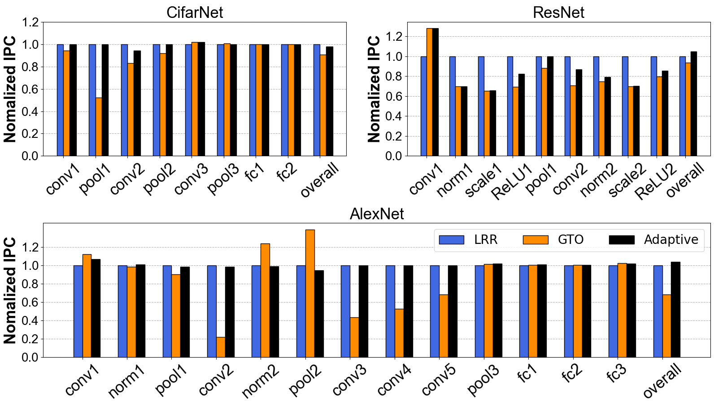

# 1. plot

## 1.1 hist

```python
data = [0,1,2,5,6,5,8,7,64,66,5,8,8,8,8,8]
plt.hist(data, bins=3, label="weight")	
```

### 1.1.1 参数
<div align=left>

</div>

+ bins，直方图的 bucket，bins = 3 表示将区间分为 3 buckets。数值范围是 0-66，那么大概分为 0-22，23-45，45-67 三个 bucket，然后根据 `data` 中的情况，往这几个 bucket 投票/计数。
+ range，x 轴的显示范围

## 1.2 通用设置
### 1.2.1 label 设置

给出y轴的名称

论文中时常需要设置 y 轴参数

plt.legend() 显示 label
```python
plt.legend(loc='upper right', ncol=3, fontsize=30) 
```
ncol 设置行列如何排布，有时候需要排成一排，有时候需要排成一列
### 1.2.2 坐标轴刻度 scale

#### 1.2.2.1 plt.xticks(), plt.yticks()

关于刻度的一些设置

```python
xticks(locs, [labels], **kwargs)  # Set locations and labels
plt.yticks(np.arange(0.5, 1.3, step=0.05),family= 'Arial', weight= 'normal', size=20)
```
np.arange(0.5, 1.3, step=0.05) 设置刻度的范围和步长

不显示 y 轴刻度

```python
yticks([])
```

#### 1.2.2.2 plt.ylim((0.5, 1.3))

设置坐标轴范围，为 0.5-1.3

#### 1.2.2.3 plt.xscale, plt.yscale 对数坐标轴

```python
def draw():
    draw_max = resnet18_base.layer4_bb2_Conv2d_2['max']
    x = np.arange(0, len(draw_max))
    plt.plot(x, draw_max, color='r', label="max")
    plt.legend()
    plt.xscale('log') # 默认 base is 10
    plt.yscale('log', base=2) # 可以手动设置为 2
    plt.savefig('../img/fig_conv.png')
    plt.close()
```

对于 y 轴对数化比较简单。如果是对于 hist，x 轴想要使用 log 坐标轴，需要调整参数 bins
```python
plt.ylabel('number')
plt.xlabel('value')
plt.hist( tmp_channel_list[i] , bins=20, color='green',label="activation channel", density=True)
plt.legend()
plt.title('Activation Distribution')
str_index = 'ep' + str(epoch_idx) + '_it' + str(iteration_idx) + '_l' + str(index) + '_c' + str(i) + '_' 
# plt.yscale('log', base=2)
# plt.xscale('log', base=2)
plt.savefig('/nvme/wmhu/work/ant_extension/ant_quantization/ImageNet/distri/img/' + args.model + '/chan_img/fig_'+ str_index +'.png')
plt.close()
```

### 1.2.3 其他

#### 1.2.3.1 plt.title()

```python
plt.title(filename, {'family' : 'Arial', 'weight' : 'normal', 'size' : 20})
```

#### 1.2.3.2 plt.subplot()

这个是画图的时候比较常用的

```python
    # 分成2x2，占用第一个，即第一行第一列的子图
    plt.subplot(2, 2, 1)
    filename = 'cifar'
    show_graph_cifar(filename)
    # 分成2x2，占用第一个，即第一行第一列的子图
    plt.subplot(2, 2, 2)
    filename = 'resnet'
    show_graph_resnet(filename)
	# 分成2x1，占用第二个，即第二行
    plt.subplot(2, 1, 2)
    filename = 'alex'
    show_graph_alex(filename)
```

效果 
<div align=left>

</div>
##### plt.legend()

参数 `ncol` 设置列数，可以把他们排成一行

#### 1.2.3.3 plt.grid

如何把网格放在最底层？zorder 似乎没有效果。虽然警告了 `zorder unknown word`，但是设置之后还是 work 了。

```python 
plt.grid(visible=True, which='major', axis='y', linestyle='--', zorder=0)
```
zorder 设置值比 bar 更小，就可以放在最底层了

#### 1.2.3.4 plt.bar() 绘制直方图和叠加直方图

叠加直方图这次没做，不过不是很难，大概是给 bar 指定一个起始位置

```python
plt.bar(x_length + bar_width,y_8,width=bar_width,label="8 entry", color='darkorange', edgecolor='black', zorder=3)
```

加上边框 edgecolor 会好看很多。

#### 1.2.3.5 plt.subplots_adjust(bottom=0.35)

提前设置好 top, bottom, 各种空白等参数，让打出来的图片可以直接使用

#### 1.2.3.6 color 参数
<div align=left>

</div>

#### 1.2.3.7 在服务器上使用 matplotlib / savefig

这里特指的是没有图形界面的服务器，需要将图片保存下来查看，而不能直接生成图片。

```python
import matplotlib 
matplotlib.use('Agg')
# 在 plt 之前添加上述两行代码
import matplotlib.pyplot as plt

# 设置保存图片的位置
plt.savefig('/home/wmhu/share/figure/fig1.png')

# 如果需要绘制多个图片，记得在每一个 savefig 下面接一个 close ，不然会重叠
plt.close()
```